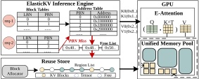

# ElasticKV
A Inference Engine that supports on-demand KV cache allocation during inference.

<p align="center">
  
</p>


## Cooperate with Tangram

ElasticKV works with Tangram, which reuse GPU memroy between models in Serverless LLM to optimize the cold-start latency.

Enable ElasticKV in vLLM:
````python
import vllm
ElasticKVLLM = vllm.LLM(
  model = "<model_path in local directory>",
  # other arguments
  load_format = "serverless_llm",
  served_model_name = "<model_name>--<Tangram address>",
  # other arguments
)

ElasticKVLLM.generate(
  "<prompt>",
  # other arguments
)

````

---

## Acknowledgements
This project is a fork of [vLLM](https://github.com/vllm-project/vllm), and I would like to thank the original author(s) for their amazing work.

